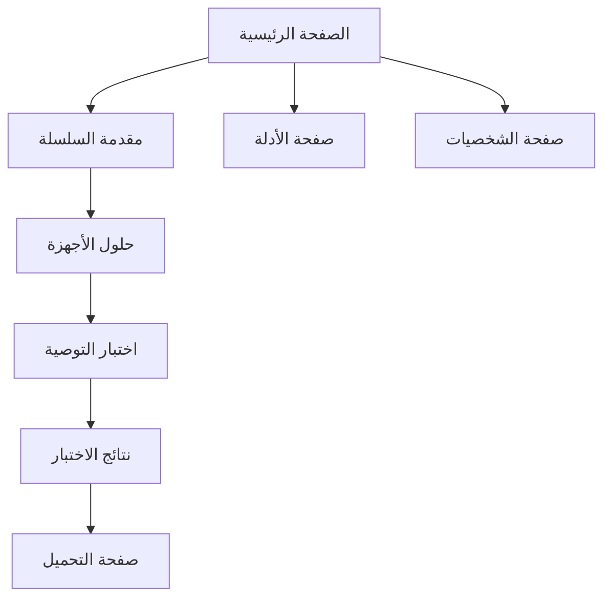

## 1. نظرة عامة على المنتج
منصة الويب العربية الرائدة لامتياز "ذا ليجند أوف زيلدا" - تجربة حديثة ومغامرة تفاعلية من خلال التصفح بالتمرير. المنصة مصممة لمحبي السلسلة الناطقين بالعربية مع حماية صارمة من حرق الأحداث.

تستهدف المنصة جمهور اللاعبين العرب الذين يرغبون في استكشاف عالم زيلدا بلغتهم الأم مع ضمان عدم التعرض للحرقات الروائية.

## 2. الميزات الأساسية

### 2.1 أدوار المستخدمين
| الدور | طريقة التسجيل | الصلاحيات الأساسية |
|------|----------------|-------------------|
| زائر | بدون تسجيل | تصفح المحتوى، حل الاختبارات، قراءة الأدلة |
| مشرف | ترقية يدوية | إدارة المحتوى، تحديث المعلومات، مراجعة التعليقات |

قرار النسخة الأولى: لا يوجد نظام تسجيل دخول للمستخدم النهائي. حفظ نتائج الاختبار وتفضيلات اللاعب يتم محلياً عبر Local Storage لتجربة أسرع وبدون أي احتكاك.

### 2.2 وصف الوحدات
يتكون موقع زيلدا العربي من الصفحات الرئيسية التالية:
1. **الصفحة الرئيسية**: قسم البطل، مقدمة السلسلة، حلول الأجهزة، اختبار التوصية
2. **صفحة الاختبار**: أسئلة متعددة الخيارات، خوارزمية التوصية، نتائج مخصصة
3. **صفحة الأدلة**: دليل المحاكاة، إعدادات الألعاب، نصائح الأداء
4. **صفحة الشخصيات**: ملفات لينك، زيلدا، جانوندورف مع نظام حماية من الحرقات
5. **صفحة الألعاب**: معلومات الأجزاء، الترتيب الزمني، نظام تقييم بدون حرقات

### 2.3 تفاصيل الصفحات
| اسم الصفحة | اسم الوحدة | وصف الميزة |
|-----------|------------|------------|
| الصفحة الرئيسية | قسم البطل | عرض صورة هايرول الواسعة مع تأثير البانوراما البطيء، شعار زيلدا الذهبي في المنتصف |
| الصفحة الرئيسية | مقدمة السلسلة | نص عربي يظهر بالتدريج: "وش هي سلسلة أسطورة زيلدا؟" مع أزرار تفاعلية للشخصيات الثلاث |
| الصفحة الرئيسية | حلول الأجهزة | نص منبثق: "الإجابة القاطعة: لا!" مع زر CTA للدليل الشامل للمحاكاة |
| الصفحة الرئيسية | اختبار التوصية | نص منبثق مع زر CTA كبير: "ابدأ الاختبار: حدد لعبتك الجاية من زيلدا" |
| صفحة الاختبار | أسئلة متعددة | نظام أسئلة متدرج يحلل تفضيلات اللاعب بدون حرقات |
| صفحة الاختبار | الخوارزمية | حساب ذكي يوصي باللعبة المناسبة بناءً على الإجابات |
| صفحة الاختبار | النتائج | عرض اللعبة المقترحة مع سبب التوصية وروابط التحميل |
| صفحة الأدلة | دليل المحاكاة | شرح خطوات تثبيت المحاكي مع صور توضيحية |
| صفحة الأدلة | إعدادات الألعاب | إرشادات تحسين الأداء والرسومات |
| صفحة الشخصيات | ملفات الشخصيات | معلومات أساسية مع نظام إخفاء تلقائي للحرقات |
| صفحة الألعاب | معلومات الأجزاء | قائمة الألعاب مع نظام تصفية بدون حرقات |

### 2.4 سياسة منع الحرق (الوضع الافتراضي)
- أي نص قصصي أو تفاصيل أحداث يتم عرضه مموهاً افتراضياً بتأثير Blur.
- لا يتم كشف المحتوى إلا بتفاعل صريح من المستخدم عبر الضغط على عنصر Spoiler Toggle.
- كل صفحات الشخصيات والألعاب والنتائج تعتمد مسارات آمنة تمنع عرض معلومات حساسة تلقائياً.
- يتم الحفاظ على حالة الكشف محلياً لكل عنصر داخل الجلسة لضمان تجربة متوقعة بدون حرق غير مقصود.

## 3. العمليات الأساسية
يتبع المستخدم رحلة تفاعلية:
1. يبدأ من الصفحة الرئيسية مع تجربة التمرير السردية
2. يتعرف على السلسلة من خلال النصوص المتدرجة
3. يكتشف إمكانية اللعب على PC/المحمول
4. يحل الاختبار للحصول على توصية لعبته الأولى
5. يتصفح الأدلة والشخصيات بأمان بدون حرقات

## 4. تصميم واجهة المستخدم

### 4.1 أسلوب التصميم
- الألوان الأساسية: الذهبي (#FFD700)، الأخضر الزمردي (#008080)، الأزرق الداكن (#001F3F)
- أزرار: تصميم 3D مع تأثيرات الظل والتدرج
- الخطوط: Noto Kufi Arabic للعناوين، Noto Naskh Arabic للنصوص
- التخطيط: تصميم عمودي مع أقسام كاملة الشاشة
- الأيقونات: رموز زيلدا الكلاسيكية مع لمسة عربية

### 4.2 نظرة عامة على تصميم الصفحات
| اسم الصفحة | اسم الوحدة | عناصر واجهة المستخدم |
|-----------|------------|----------------------|
| الصفحة الرئيسية | قسم البطل | خلفية هايرول مع تأثير البانوراما، شعار زيلدا الذهبي بتأثير التدرج، شريط تمرير عمودي |
| الصفحة الرئيسية | مقدمة السلسلة | نص عربي بتأثير الظهور التدريجي، أزرار شخصيات بتصميم ذهبي تفاعلي |
| الصفحة الرئيسية | حلول الأجهزة | نص منبثق مع تأثير الارتداد، زر CTA كبير بتصميم 3D مع تأثير الإضاءة |
| صفحة الاختبار | الأسئلة | بطاقات أسئلة بتصميم شفاف مع خيارات دائرية، شريط تقدم أنيق |
| صفحة النتائج | عرض النتائج | بطاقة اللعبة المقترحة مع صورة الغلاف، وصف مختصر، أزرار التحميل |

### 4.3 التجاوبية
تصميم أولويية لسطح المكتب مع تكيف تلقائي للأجهزة المحمولة. دعم كامل لأجهزة اللمس مع تكبير/تصغير سلس للعناصر التفاعلية.

### 4.4 إرشادات مشاهد 3D
- البيئة: خلفية هايرول مع إضاءة غروب الشمس، سماء واسعة مع غيوم ديناميكية
- الإضاءة: ضوء الشمس الذهبي من الخلف مع تأثير الشفق، إضاءة محيطة دافئة
- الكاميرا: زاوية واسعة (FOV 75°)، حركة بانورامية بطيئة من اليسار لليمين
- التكوين: طبقات عمق مع المقدمة (أشجار)، المتوسط (الوادي)، الخلفية (الجبال)
- التفاعل: تأثيرات التمرير مع تغيير الإضاءة، ظهور النصوص بالتزامن مع الحركة
- المعالجة اللاحقة: تأثير Bloom خفيف، ضبط التباين، تعيين الألوان الدافئة
