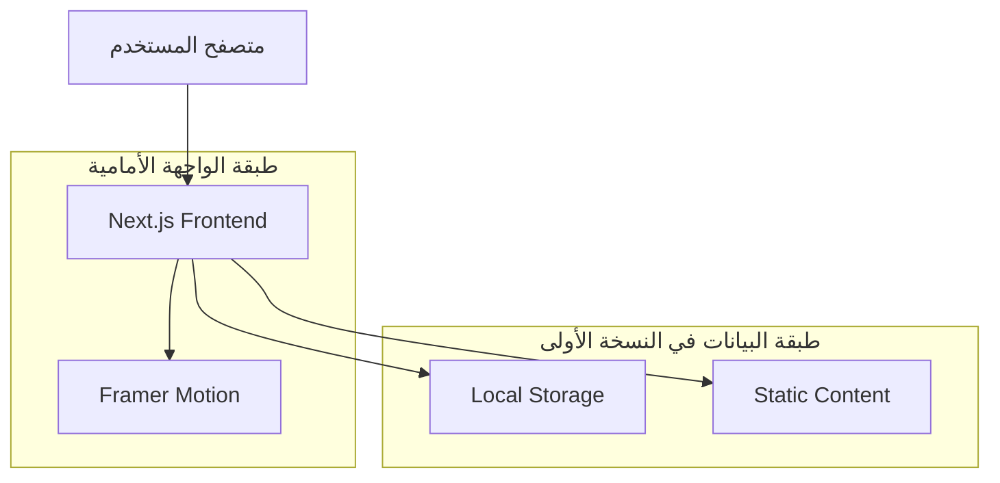
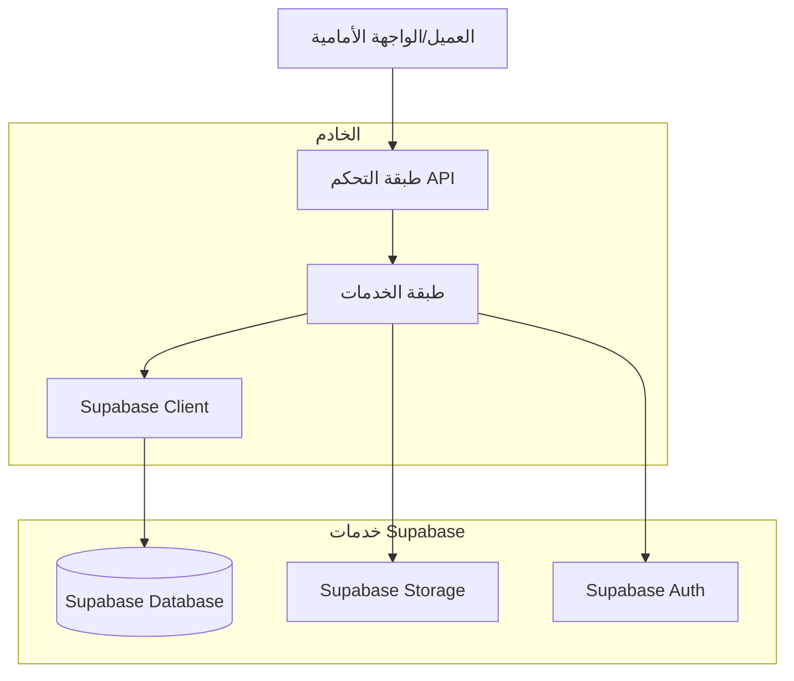
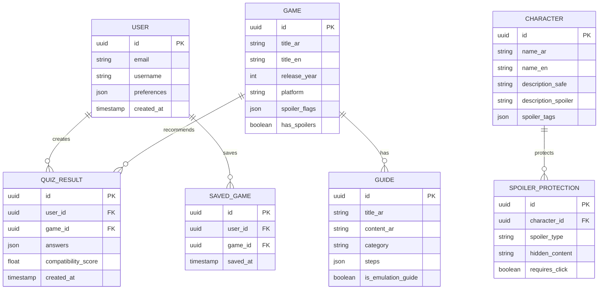

## 1. تصميم المعمارية



## 2. وصف التكنولوجيا
- الواجهة الأمامية: Next.js@16 + React@19 + TypeScript
- أدوات التهيئة: create-next-app
- التصميم: CSS Modules/Global CSS + Framer Motion
- الخطوط: next/font مع Noto Arabic
- التخزين المحلي: Local Storage لحفظ نتائج وتفضيلات الاختبار
- إدارة المحتوى: صفحات ومسارات ثابتة في النسخة الأولى

## 3. تعريفات المسارات
| المسار | الغرض |
|--------|--------|
| / | الصفحة الرئيسية مع تجربة التمرير السردية |
| /quiz | اختبار التوصية مع الأسئلة المتعددة |
| /quiz/results | نتائج الاختبار والتوصيات |
| /guides | صفحة الأدلة والدروس التعليمية |
| /guides/emulation | دليل المحاكاة التفصيلي |
| /characters | قائمة الشخصيات الرئيسية |
| /characters/[slug] | صفحة تفاصيل الشخصية مع حماية الحرقات |
| /games | قائمة ألعاب السلسلة |
| /games/[slug] | صفحة تفاصيل اللعبة مع نظام الحرقات |

## 4. تعريفات واجهة برمجة التطبيقات

### 4.1 واجهات API الأساسية

في النسخة الأولى لا توجد واجهات API للمستخدم النهائي. يتم حفظ تفضيلات الاختبار والنتيجة المقترحة محلياً عبر Local Storage بدون تسجيل دخول.

**التخزين المحلي المعتمد**
- `hyrule-oasis.quiz.preferred-style`: نوع الأسلوب المفضل من إجابة الاختبار.
- `hyrule-oasis.quiz.recommendation`: اللعبة المقترحة الحالية.

### 4.2 سياسة منع الحرق الافتراضية
- أي محتوى قصصي يظهر مموهاً افتراضياً (Blur) ضمن عنصر Spoiler Toggle.
- الكشف لا يتم إلا عند ضغط المستخدم على العنصر بشكل صريح.
- مسارات الشخصيات والألعاب تستخدم نسخة آمنة من الوصف قبل أي كشف يدوي.

## 5. مخطط هندسة الخادم



## 6. نموذج البيانات

### 6.1 تعريف نموذج البيانات


### 6.2 لغة تعريف البيانات

**جدول المستخدمين (users)**
```sql
-- إنشاء الجدول
CREATE TABLE users (
    id UUID PRIMARY KEY DEFAULT gen_random_uuid(),
    email VARCHAR(255) UNIQUE NOT NULL,
    username VARCHAR(100) UNIQUE NOT NULL,
    preferences JSONB DEFAULT '{}',
    created_at TIMESTAMP WITH TIME ZONE DEFAULT NOW(),
    updated_at TIMESTAMP WITH TIME ZONE DEFAULT NOW()
);

-- إنشاء الفهارس
CREATE INDEX idx_users_email ON users(email);
CREATE INDEX idx_users_username ON users(username);
```

**جدول نتائج الاختبار (quiz_results)**
```sql
-- إنشاء الجدول
CREATE TABLE quiz_results (
    id UUID PRIMARY KEY DEFAULT gen_random_uuid(),
    user_id UUID REFERENCES auth.users(id) ON DELETE CASCADE,
    game_id UUID REFERENCES games(id),
    answers JSONB NOT NULL,
    compatibility_score FLOAT NOT NULL,
    created_at TIMESTAMP WITH TIME ZONE DEFAULT NOW()
);

-- إنشاء الفهارس
CREATE INDEX idx_quiz_results_user_id ON quiz_results(user_id);
CREATE INDEX idx_quiz_results_game_id ON quiz_results(game_id);
CREATE INDEX idx_quiz_results_created_at ON quiz_results(created_at DESC);
```

**جدول الألعاب (games)**
```sql
-- إنشاء الجدول
CREATE TABLE games (
    id UUID PRIMARY KEY DEFAULT gen_random_uuid(),
    title_ar VARCHAR(255) NOT NULL,
    title_en VARCHAR(255) NOT NULL,
    release_year INTEGER NOT NULL,
    platform VARCHAR(100) NOT NULL,
    spoiler_flags JSONB DEFAULT '{}',
    has_spoilers BOOLEAN DEFAULT false,
    created_at TIMESTAMP WITH TIME ZONE DEFAULT NOW()
);

-- إنشاء الفهارس
CREATE INDEX idx_games_title_ar ON games(title_ar);
CREATE INDEX idx_games_release_year ON games(release_year);
```

**جدول الشخصيات (characters)**
```sql
-- إنشاء الجدول
CREATE TABLE characters (
    id UUID PRIMARY KEY DEFAULT gen_random_uuid(),
    name_ar VARCHAR(100) NOT NULL,
    name_en VARCHAR(100) NOT NULL,
    description_safe TEXT NOT NULL,
    description_spoiler TEXT,
    spoiler_tags JSONB DEFAULT '{}',
    created_at TIMESTAMP WITH TIME ZONE DEFAULT NOW()
);

-- إنشاء الفهارس
CREATE INDEX idx_characters_name_ar ON characters(name_ar);
```

**جدول الأدلة (guides)**
```sql
-- إنشاء الجدول
CREATE TABLE guides (
    id UUID PRIMARY KEY DEFAULT gen_random_uuid(),
    title_ar VARCHAR(255) NOT NULL,
    content_ar TEXT NOT NULL,
    category VARCHAR(100) NOT NULL,
    steps JSONB DEFAULT '[]',
    is_emulation_guide BOOLEAN DEFAULT false,
    created_at TIMESTAMP WITH TIME ZONE DEFAULT NOW(),
    updated_at TIMESTAMP WITH TIME ZONE DEFAULT NOW()
);

-- إنشاء الفهارس
CREATE INDEX idx_guides_category ON guides(category);
CREATE INDEX idx_guides_is_emulation ON guides(is_emulation_guide);
```

**البيانات الأولية**
```sql
-- إدخال بيانات الألعاب
INSERT INTO games (title_ar, title_en, release_year, platform, has_spoilers) VALUES
('ذا ليجند أوف زيلدا: بريذ أوف ذا وايلد', 'The Legend of Zelda: Breath of the Wild', 2017, 'Nintendo Switch', true),
('ذا ليجند أوف زيلدا: تيرز أوف ذا كينجدوم', 'The Legend of Zelda: Tears of the Kingdom', 2023, 'Nintendo Switch', true),
('ذا ليجند أوف زيلدا: أوكارينا أوف تايم', 'The Legend of Zelda: Ocarina of Time', 1998, 'Nintendo 64', true);

-- إدخال بيانات الشخصيات
INSERT INTO characters (name_ar, name_en, description_safe, description_spoiler) VALUES
('لينك', 'Link', 'البطل الصامت الذي يحمل مصير إنقاذ هايرول', NULL),
('زيلدا', 'Zelda', 'الأميرة الحامية لحكمة ترايفورس', NULL),
('جانوندورف', 'Ganondorf', 'سيد الشر الذي يسعى للحصول على القوة', NULL);

-- إدخال الأدلة
INSERT INTO guides (title_ar, content_ar, category, is_emulation_guide) VALUES
('الدليل الشامل لتحميل وتشغيل الألعاب', 'دليل شامل لمحاكاة ألعاب زيلدا على PC والمحمول', 'emulation', true),
('إعدادات المحاكي الأمثل', 'إرشادات تحسين الأداء والرسومات', 'performance', true);
```

**سياسات الأمان (Supabase Row Level Security)**
```sql
-- تمكين RLS
ALTER TABLE users ENABLE ROW LEVEL SECURITY;
ALTER TABLE quiz_results ENABLE ROW LEVEL SECURITY;
ALTER TABLE games ENABLE ROW LEVEL SECURITY;
ALTER TABLE characters ENABLE ROW LEVEL SECURITY;
ALTER TABLE guides ENABLE ROW LEVEL SECURITY;

-- سياسات القراءة للجميع
CREATE POLICY "الجميع يمكنهم قراءة الألعاب" ON games FOR SELECT USING (true);
CREATE POLICY "الجميع يمكنهم قراءة الشخصيات" ON characters FOR SELECT USING (true);
CREATE POLICY "الجميع يمكنهم قراءة الأدلة" ON guides FOR SELECT USING (true);

-- سياسات المستخدمين المصدقين
CREATE POLICY "المستخدمون المصدقون يمكنهم إنشاء نتائج الاختبار" ON quiz_results FOR INSERT 
    WITH CHECK (auth.uid() = user_id);
    
CREATE POLICY "المستخدمون المصدقون يمكنهم قراءة نتائجهم" ON quiz_results FOR SELECT 
    USING (auth.uid() = user_id);

-- منح الصلاحيات
GRANT SELECT ON games TO anon, authenticated;
GRANT SELECT ON characters TO anon, authenticated;
GRANT SELECT ON guides TO anon, authenticated;
GRANT ALL ON quiz_results TO authenticated;
```
